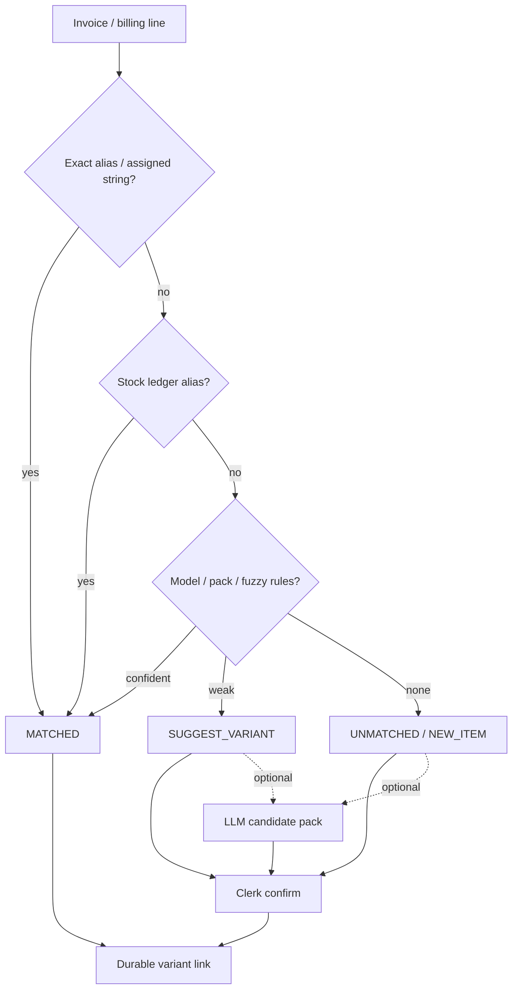
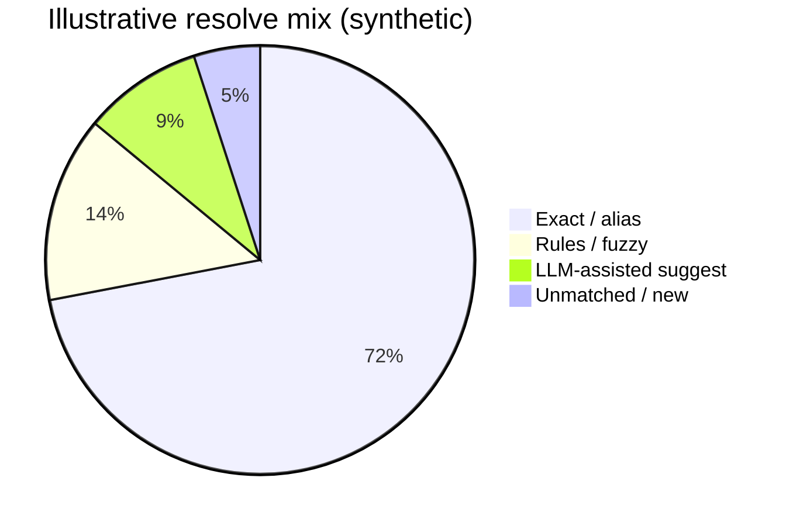

# Case study 1 — AI catalog findability

**Domain:** B2B wholesale ops (catalog + purchasing/sales invoices)  
**Role:** Product / systems design + AI resolution pipeline  
**Status:** Production pattern (details sanitized)

---

## Problem

Incoming invoice lines and billing ledgers rarely match clean catalog SKUs 1:1.

Clerks see messy strings — pack sizes, shorthand, brand aliases, OCR noise — while the business needs every sold or purchased line to land on a **real catalog variant**. Wrong matches break stock, pricing, and reporting.

The failure mode to avoid: treating “shares a generic ledger” as unfinished, or sending every line to an LLM when local aliases already know the answer.

---

## Constraints

- High volume of historical strings; accuracy matters more than novelty
- Many catalog variants may map to one billing ledger (many → one is valid)
- LLM spend and latency must stay bounded
- Human confirmation stays in the loop for ambiguous or new items
- No customer invoices or proprietary catalogs in public materials

---

## Approach

### Local-first cascade, LLM as opt-in assist



**Design choices**

1. **Wire findability on the variant** — durable alias lists on the catalog side, not one-off prompt memory.
2. **Resolve must prefer local exact/alias hits** — already-wired lines never need a model round-trip.
3. **Status vocabulary for ops** — `MATCHED` / `SUGGEST_VARIANT` / `UNMATCHED` / `NEW_ITEM` so the UI is an exception queue, not a chat transcript.
4. **Family-scoped enrichment** — when a family is thin on structure, use richer historical clerk notes as variant signals before inventing a Cartesian matrix.

### What “wired” means (audit tiers)

| Tier | Meaning |
| --- | --- |
| Confirmed wired | ≥1 billing string resolves to a real stock ledger name or alias |
| Findability only | Tallies present but none hit live stock items |
| Unwired | No assigned billing strings yet |

This keeps the team honest: a pretty catalog card without invoice findability is not done.

---

## Analytics that mattered

Illustrative metrics (synthetic magnitudes for portfolio; production numbers stay private):

| Metric | Why it matters |
| --- | --- |
| Line match rate (exact/alias vs model vs miss) | Proves local-first is carrying the load |
| Clerk confirm time on suggestions | Measures whether AI proposals are useful |
| False-match escapes | Catches dangerous “confident but wrong” paths |
| Family coverage by audit tier | Prioritizes cleanup work |



---

## Outcome

- Clerks spend time on **exceptions**, not retyping known aliases
- Catalog work is dual-goal: rich product attributes **and** invoice findability
- AI cost stays proportional to ambiguity, not to total line volume
- Stock and sales systems inherit stable variant IDs instead of free-text drift

---

## What I’d improve next

- Offline eval sets of anonymized billing strings with gold variant IDs
- Per-family budgets and automatic “stop calling the model” once local hit rate clears a threshold
- Stronger pack÷N / buy-vs-sell guards surfaced as first-class resolve reasons

---

## Screenshots (placeholders)

> Replace with blurred UI / synthetic data before sharing widely.

| Asset | Intent |
| --- | --- |
| `assets/01-resolve-table.png` | Resolve table with status badges (MATCHED / SUGGEST) |
| `assets/01-audit-tiers.png` | Family audit summary by wired tier |

```text
assets/
  01-resolve-table.png   # TODO: blurred clerk UI
  01-audit-tiers.png     # TODO: synthetic chart or redacted dashboard
```
