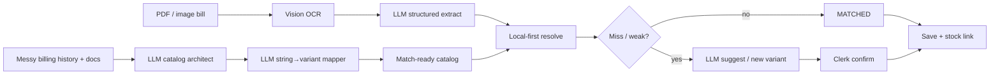
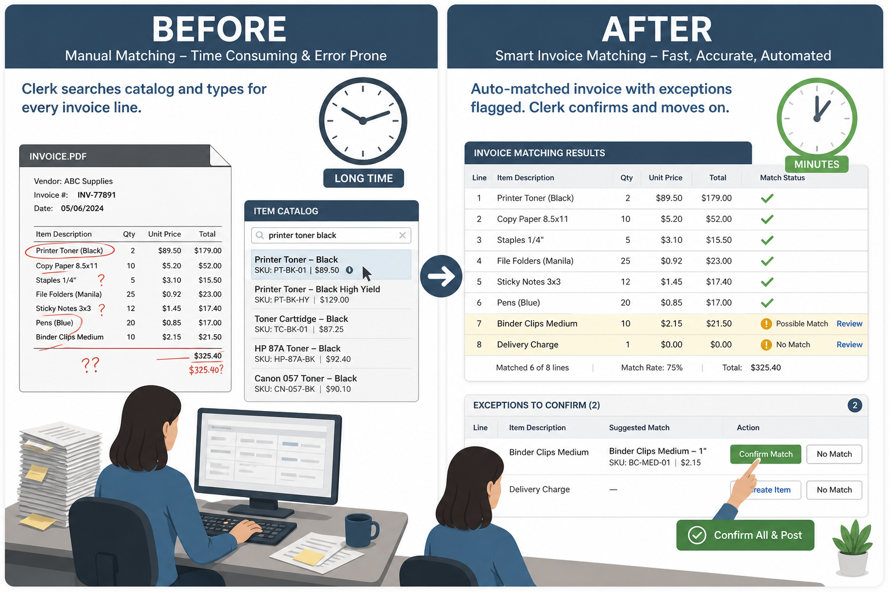
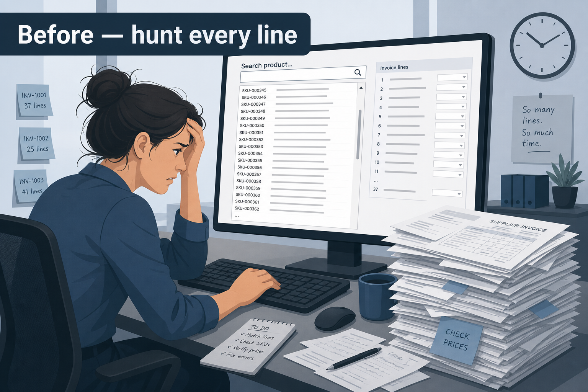
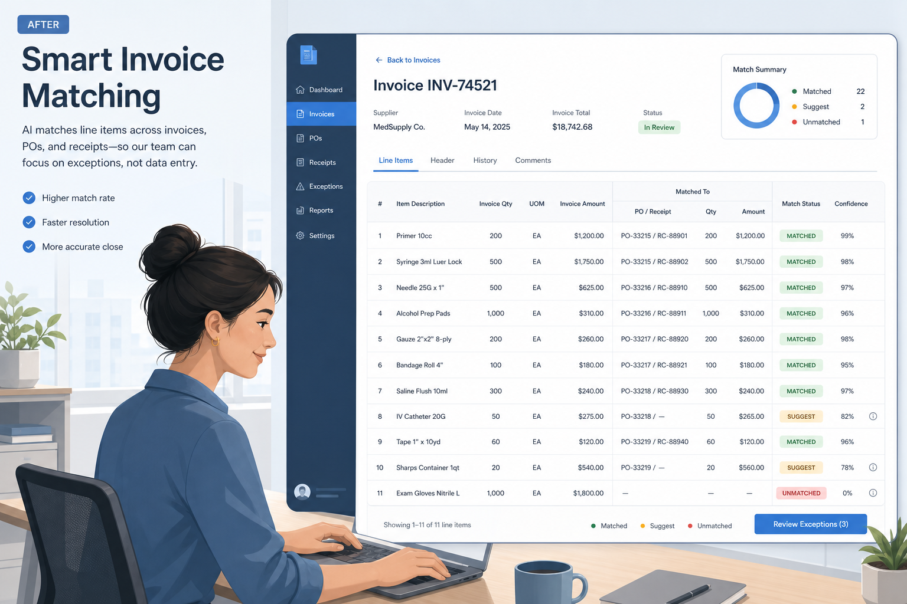
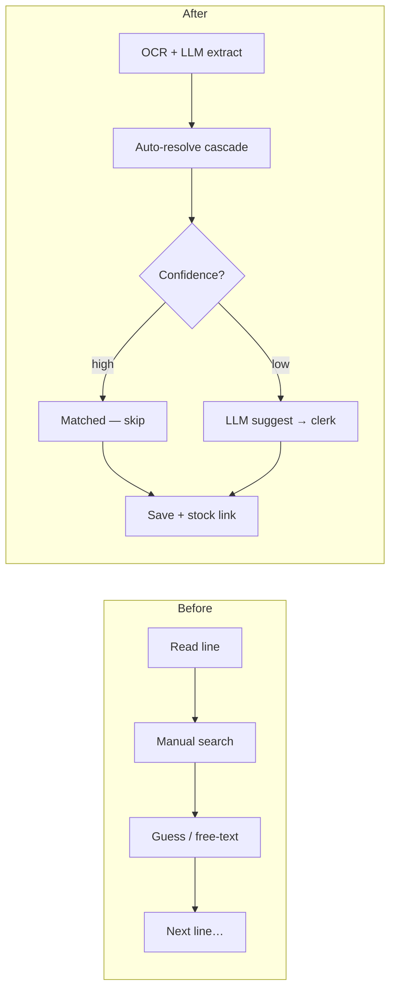
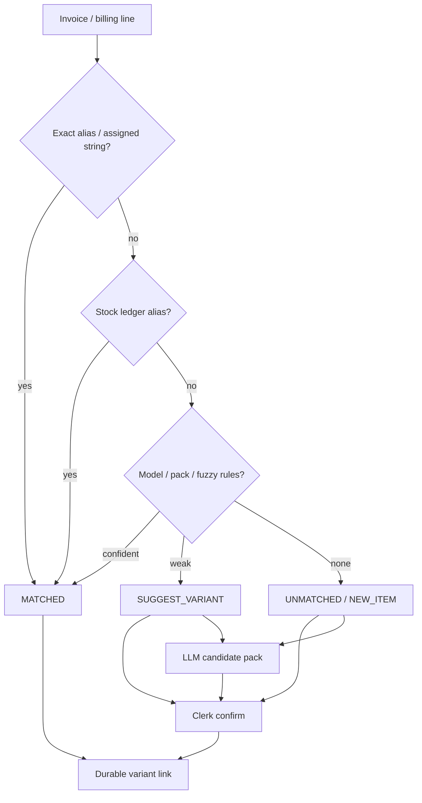
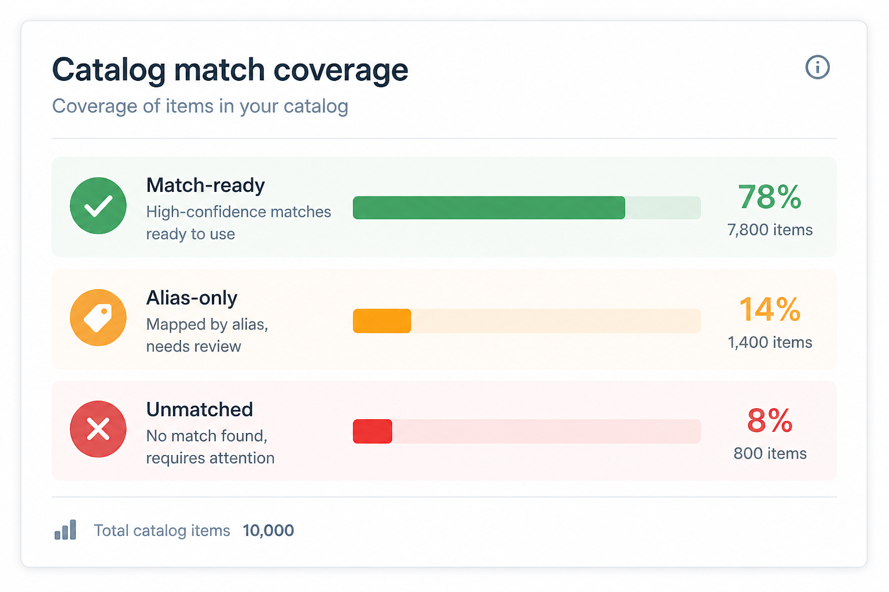
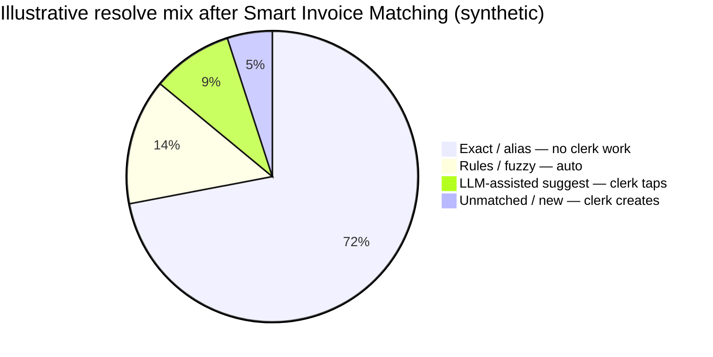

# Smart Invoice Matching

**Domain:** B2B wholesale ops (purchase & sales invoices ↔ catalog)  
**Role:** Product / AI systems design + full pipeline  
**One-liner:** AI reads the bill, builds/extends the catalog, and matches lines to real products — clerks only review exceptions.

---

## AI in this product (more than “a match button”)

Matching is the visible tip. Underneath, AI runs at **four** stages:

| Stage | AI role | Clerk role |
| --- | --- | --- |
| **1. Extract** | Vision OCR + LLM → structured lines (description, qty, batch, expiry, amounts) | Fix bad cells in a table |
| **2. Catalog intelligence** | LLM designs rich variant matrices from Tally-style strings, price lists, IFUs; second step maps billing strings onto variants (avoids blind Cartesian SKUs) | Publish / correct families |
| **3. Research assist** | Retrieve manufacturer pages/PDFs; OCR docs; LLM emits catalog specs + alias candidates | Accept or reject proposed structure |
| **4. Resolve assist** | On weak/local misses only: LLM proposes `SUGGEST` / `NEW` with attribute guesses | One-tap confirm — never silent write |

**Also in the loop:** historical clerk notes as variant signals (sizes, packs, models) when a family is thin; per-family model budgets so spend stays proportional to ambiguity.

Without stages 2–3, stage 4 has nothing trustworthy to match against. The product is an **AI catalog + AI invoice pipeline**, not only a search box.

---

## Before → After (clerk day)

### Before — “Type, search, hope”

A supplier PDF or sales bill lands. For **every line**, a clerk typically:

1. Reads a messy billing string (“Brand X primer 10ml”, OCR garbage, pack shorthand)
2. Opens the catalog / stock list and **searches by memory**
3. Picks something that *looks* right — or invents a free-text description
4. Moves on; wrong size / pack / variant only shows up later in stock or customer complaints
5. Repeats for 20–80 lines per bill

**Pain:** slow, dependent on tribal knowledge, inconsistent names, no reliable link from “what was billed” to “what we stock.”

### After — “AI extract → auto-match → confirm the red rows”

1. Clerk uploads the bill — **Vision + LLM** extract structured lines
2. System resolves each line **local-first** (exact aliases → ledger aliases → rules/fuzzy)
3. Misses get an **LLM suggestion** (or new-variant path), not a blank search box
4. Table: green **MATCHED**, amber **SUGGEST**, red **UNMATCHED / NEW**
5. Clerk only works amber/red; save writes durable variant links (aliases learn)

**Gain:** AI does extract + catalog + long-tail suggest; clerks do judgment, not typing.

---

## Concrete before / after on one line (synthetic)

| | Before | After |
| --- | --- | --- |
| **What clerk sees** | `ORMCO ORTHO SOLO PRIM 10CC` on a PDF | Extracted row + resolve status |
| **What clerk does** | Search “ortho”, “solo”, “primer”… pick from memory | Often already **MATCHED**; else tap **SUGGEST** |
| **If unknown pack** | Guess or leave as free text | LLM/attribute dropdowns → confirm |
| **What gets saved** | Ambiguous description | Variant ID + billing name + notes |
| **Next time same string** | Search again | Instant exact/alias — **no model call** |

---

## Problem (why this mattered)

Incoming invoice lines rarely match clean catalog SKUs 1:1. Pack sizes, shorthand, brand aliases, and OCR noise break stock, pricing, and sold metrics unless every line lands on a **real variant**.

Failure modes we designed against:

- Sending **every** line to an LLM when aliases already know the answer
- Using AI only at match-time while the catalog itself stays hand-built and incomplete
- Pretty catalog cards that still don’t **match from a real invoice line**

---

## Approach

### Local-first cascade, LLM as measured assist

**Design choices**

1. **Multi-model jobs** — extract, catalog architect, string mapper, and miss-suggest are separate contracts
2. **Store match aliases on the variant** — durable billing strings, not one-off prompt memory
3. **Already-matched lines never call the model**
4. **Coverage tiers** keep the team honest about what’s actually match-ready

| Tier | Meaning |
| --- | --- |
| Match-ready | ≥1 billing string resolves to a real stock ledger name or alias |
| Alias-only | Strings present but none hit live stock items |
| Unmatched catalog | No assigned billing strings yet |

---

## Impact (illustrative / synthetic)

| Metric | Before (typical) | After (target shape) |
| --- | --- | --- |
| Bill intake | Retype from PDF | OCR + LLM extract → edit table |
| Clerk time per bill | Hunt every line | Touch ~10–20% exception rows |
| Resolve mix | 100% human judgment | ~70%+ exact/alias; rules + LLM on the tail |
| Catalog growth | Manual SKU invention | AI architect + mapper + human publish |
| Repeat of same string | Search again | Instant match, $0 model |

---

## What I’d improve next

- Offline eval sets of anonymized billing strings with gold variant IDs
- Per-family “stop calling the model” once local hit rate clears a threshold
- Stronger pack÷N / buy-vs-sell guards as first-class resolve reasons
- Public-safe demos of extract vs architect vs mapper as three small replay fixtures

---

## Image notes

Synthetic mockups for the public portfolio (fake product names, demo coverage %). They show clerk before/after for **Smart Invoice Matching** — not production screenshots.
