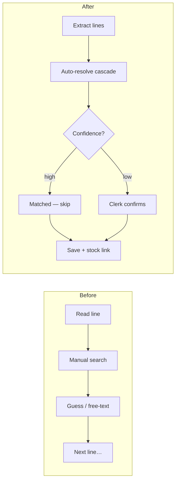
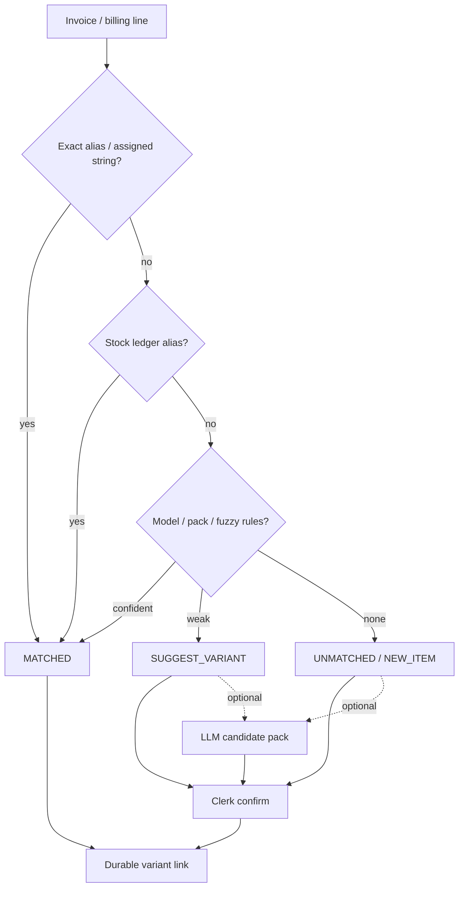
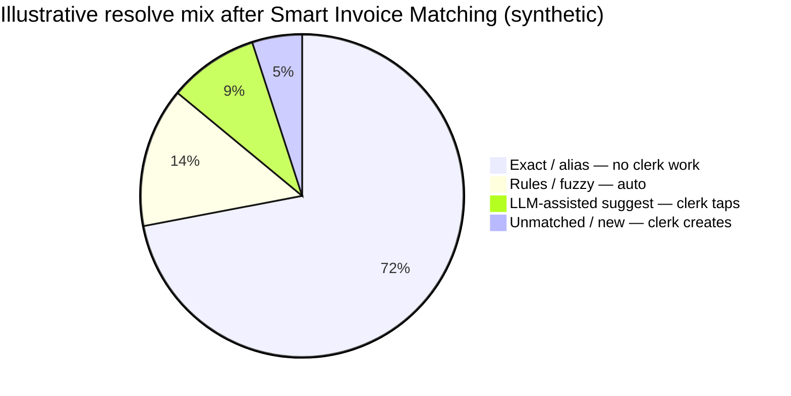

# Case study 1 — Smart Invoice Matching

**Domain:** B2B wholesale ops (purchase & sales invoices ↔ catalog)  
**Role:** Product / systems design + AI resolution pipeline  
**One-liner:** Turn messy invoice lines into matched catalog products automatically — clerks only review exceptions, not every SKU.

---

## Before → After (clerk day)

### Before — “Type, search, hope”

A supplier PDF or sales bill lands. For **every line**, a clerk typically:

1. Reads a messy billing string (“Brand X primer 10ml”, OCR garbage, pack shorthand)
2. Opens the catalog / stock list and **searches by memory**
3. Picks something that *looks* right — or invents a free-text description
4. Moves on; wrong size / pack / variant only shows up later in stock or customer complaints
5. Repeats for 20–80 lines per bill

**Pain:** slow, dependent on tribal knowledge, inconsistent names, no reliable link from “what was billed” to “what we stock.”

### After — “Upload → auto-match → confirm the red rows”

1. Clerk uploads / pastes the bill (or OCR extract)
2. System resolves each line **local-first** (exact aliases → ledger aliases → rules/fuzzy)
3. Table lights up: green **MATCHED**, amber **SUGGEST**, red **UNMATCHED / NEW**
4. Clerk only works the amber/red rows — accept suggestion, pick attributes, or create variant
5. Save writes a **durable variant link** (and aliases learn from confirmed wires)

**Gain:** most lines never need a human search; AI/LLM only helps when local matchers fail; stock and reporting inherit stable IDs.

---

## Concrete before / after on one line (synthetic)

| | Before | After |
| --- | --- | --- |
| **What clerk sees** | `ORMCO ORTHO SOLO PRIM 10CC` on a PDF | Same string in a resolve table |
| **What clerk does** | Search “ortho”, “solo”, “primer”… pick from memory | Status already **MATCHED** → Orthodontic Primer 10cc |
| **If unknown pack** | Guess or leave as free text | **SUGGEST** with size/pack dropdowns; one tap to confirm |
| **What gets saved** | Ambiguous description | Variant ID + billing name + notes |
| **Next time same string** | Search again | Instant exact/alias hit — no model call |

---

## Problem (why this mattered)

Incoming invoice lines rarely match clean catalog SKUs 1:1. Pack sizes, shorthand, brand aliases, and OCR noise break stock, pricing, and sold metrics unless every line lands on a **real variant**.

Failure modes we designed against:

- Sending **every** line to an LLM when aliases already know the answer
- Treating “shares a generic ledger” as unfinished when many→one wiring is valid
- Pretty catalog cards that still don’t **match from a real invoice line**

---

## Approach

### Local-first cascade, LLM as opt-in assist

**Design choices**

1. **Store match aliases on the variant** — durable billing strings, not one-off prompt memory
2. **Already-matched lines never call the model**
3. **Ops status vocabulary** — MATCHED / SUGGEST / UNMATCHED / NEW so the UI is an exception queue
4. **Coverage tiers** keep the team honest about what’s actually match-ready

| Tier | Meaning |
| --- | --- |
| Match-ready | ≥1 billing string resolves to a real stock ledger name or alias |
| Alias-only | Strings present but none hit live stock items |
| Unmatched catalog | No assigned billing strings yet |

---

## Impact (illustrative / synthetic)

| Metric | Before (typical) | After (target shape) |
| --- | --- | --- |
| Clerk time per bill | Hunt every line | Touch ~10–20% exception rows |
| Resolve mix | 100% human judgment | ~70%+ exact/alias, rest rules + rare LLM suggest |
| Repeat of same string | Search again | Instant match |
| Downstream stock link | Often missing / wrong | Default on save |

---

## What I’d improve next

- Offline eval sets of anonymized billing strings with gold variant IDs
- Per-family “stop calling the model” once local hit rate clears a threshold
- Stronger pack÷N / buy-vs-sell guards as first-class resolve reasons

---

## Screenshots (placeholders)

| Asset | Intent |
| --- | --- |
| `assets/01-before-manual-search.png` | Blurred old flow: search box + tribal pick |
| `assets/01-after-resolve-table.png` | Status badges — green majority, amber/red exceptions |
| `assets/01-audit-tiers.png` | Family coverage by match-ready tier |
