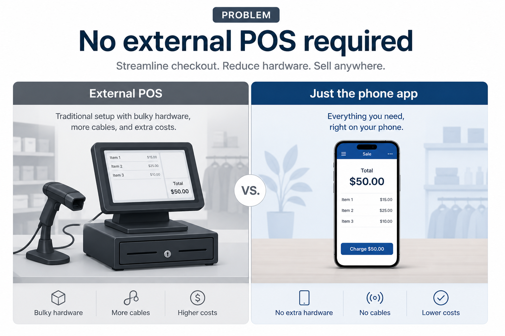
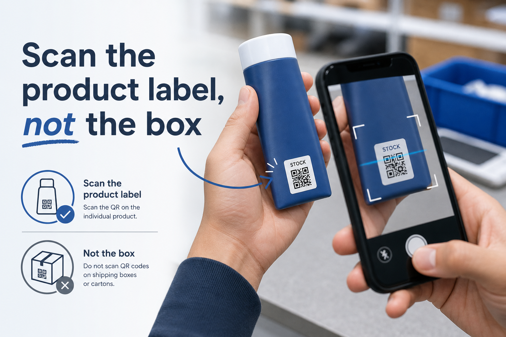
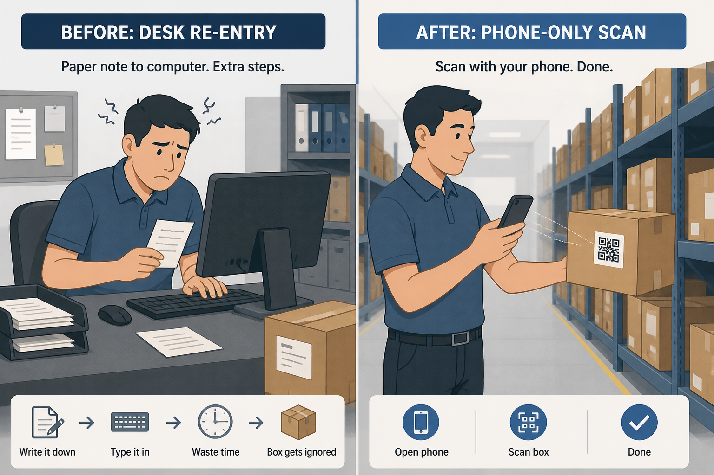
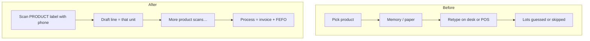
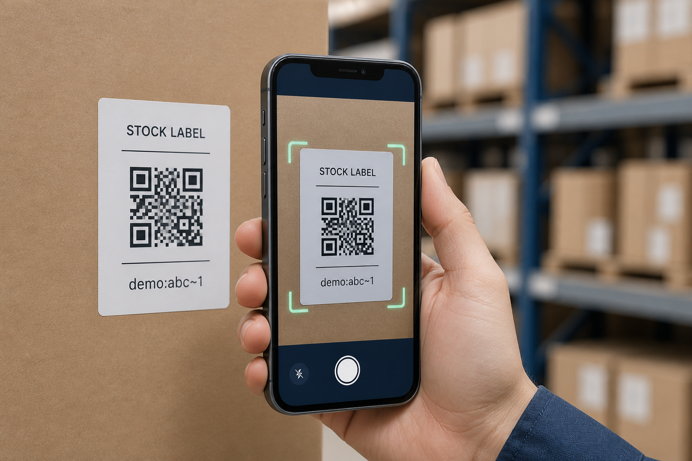
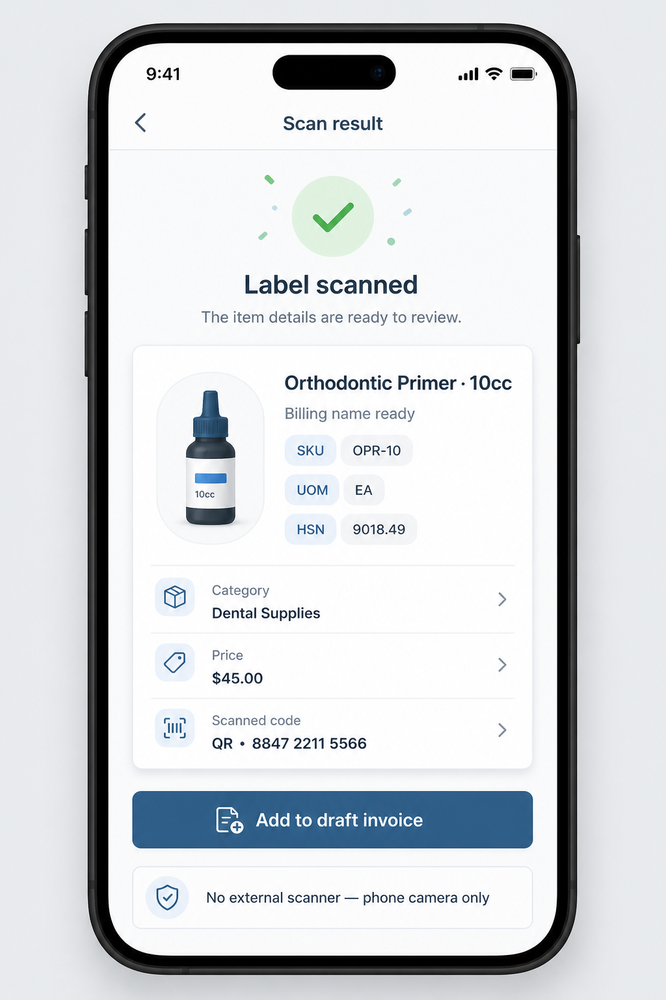
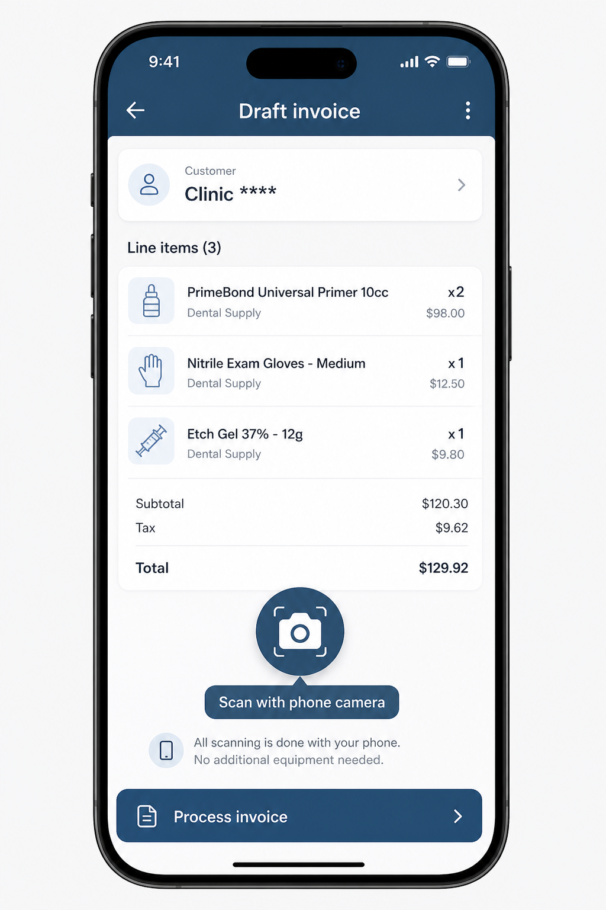
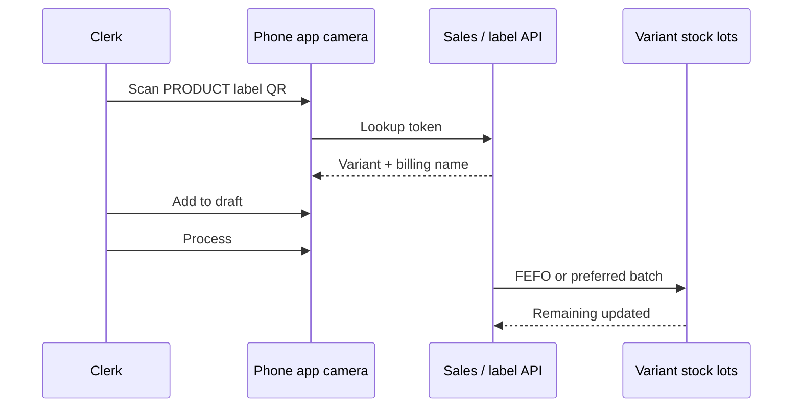

# Case study 2 — Scan → invoice → stock

**Domain:** Mobile sales ops + batch/lot inventory  
**Role:** Full-stack product (Flutter, APIs, FEFO consumption)  
**One-liner:** Build sales invoices by scanning **individual product labels** with a phone — **no external POS**, no barcode gun, no “scan the shipping carton and hope.”

---

## The problem

Wholesale counters often sit between two bad options:

1. **External POS / dedicated checkout hardware** — barcode gun, POS terminal, separate stock system. Expensive, rigid, and a poor fit when sales happen on the floor, not at a fixed till.
2. **No scan at all** — clerk walks the shelf, remembers products, then **retypes** the invoice at a desk. Wrong size/pack is common; stock and lots rarely match what actually left the hand.

A third trap looks like “scanning” but still fails ops:

3. **Scanning the outer box / carton** — the shipping case is not the sellable unit. Billing the box when the customer took one tube (or the reverse) breaks invoices, FEFO lots, and trust.

**What we needed instead**

| Requirement | Why |
| --- | --- |
| **No external POS** | Phone app *is* the capture surface — draft invoice + process lives there |
| **No dedicated scanner** | Built-in camera only, so every clerk can sell without extra hardware |
| **Scan the product, not the box** | QR lives on the **unit / product stock label** that identifies the exact variant + lot path |



*Illustrative contrast: bulky POS + gun vs a normal phone running the sales app.*

---

## What we scan (product unit, not carton)

Printed **stock labels on the product** (or unit pack), not the cardboard master carton.



```text
✓  QR on the product / unit stock sticker  →  exact variant for the invoice line
✗  QR / barcode only on the outer shipping box  →  wrong grain (case ≠ piece)
```

That distinction is the whole point: the clerk sells what they are holding, and the system bills and consumes **that** variant.

---

## Before → After (clerk day)



### Before — desk rebuild (and often a separate POS wish-list)

1. Walk the shelf; pick **products** (tubes, packs, kits)
2. Paper note or memory — names drift
3. Sit at a desktop / hoped-for POS and **retype** every line
4. Batch / expiry guessed or skipped
5. Stock updated later — or never tied to the unit that left the shelf

**Pain:** re-entry, wrong grain (box vs piece), weak FEFO, “system says 12, hand has 7.”

### After — phone is the POS surface; product label is the source of truth

1. Open the sales app on a normal phone (**no external POS terminal**)
2. Point the **camera** at the **product’s** stock-label QR
3. Preview shows the exact variant + billing name → **Add to draft**
4. Keep scanning units until the order is done
5. **Process** commits the invoice and FEFO lot drawdown

**Gain:** one device, unit-accurate lines, stock moves with the sale — not after a second system.

| | Before | After |
| --- | --- | --- |
| **Checkout system** | Desktop retype and/or external POS | Phone app only |
| **Hardware** | Gun / terminal often required or missing | Phone camera |
| **What gets scanned** | Nothing — or the wrong carton | **Product** stock label |
| **Invoice grain** | Easy to bill case vs piece wrong | Unit that was scanned |
| **Stock timing** | Later / maybe never | On process, same flow |



---

## Flow in one line

```text
Product stock label QR  →  Phone camera (no POS / no gun)  →  Draft line  →  Process → lots
```



---

## What the clerk sees after a scan





*Mock UI with synthetic names — not production screenshots.*

---

## Concrete before / after on one sale (synthetic)

| Step | Before | After |
| --- | --- | --- |
| **Identify** | Read box art; remember ledger name | Scan **product** QR → “Orthodontic Primer 10cc” |
| **System used** | Desk entry / external POS | Same phone app |
| **Add line** | Type; risk wrong pack or case qty | Tap **Add to draft** |
| **Batch** | Free text or ignore | FEFO default on process |
| **Stock** | Stale until someone remembers | Lot remaining updates with process |

---

## Approach (short)



Draft edits do **not** consume stock. **Process** does — preferred batch if overridden, else FEFO — then sold metrics land on the variant.

---

## Impact (illustrative / synthetic)

| Metric | Before | After (target shape) |
| --- | --- | --- |
| Need external POS? | Often assumed | **No** |
| Need barcode gun? | Often assumed | **No** |
| Scan grain | Carton / memory | **Product unit label** |
| Wrong case-vs-piece bills | Common | Rare when label is on the unit |
| Shelf → billed | Two-pass | Single-pass on phone |
| Stock after sale | Often stale | Lots move on process |

```text
Weekly ops narrative (demo numbers)
- Product-label scans resolved: ~98%
- Processes with no stock exception: ~94%
- Median first-scan → process: ~3–4 min
```

---

## What I’d improve next

- Auth-hardened scan APIs beyond LAN/internal use
- UX when qty must split across lots
- Offline scan queue + conflict review

---

## Image notes

Synthetic mockups for the public portfolio. They stress three claims: **problem (no POS / no gun)**, **scan the product not the box**, and **phone builds the invoice**.
