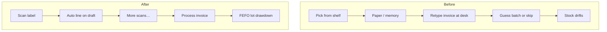
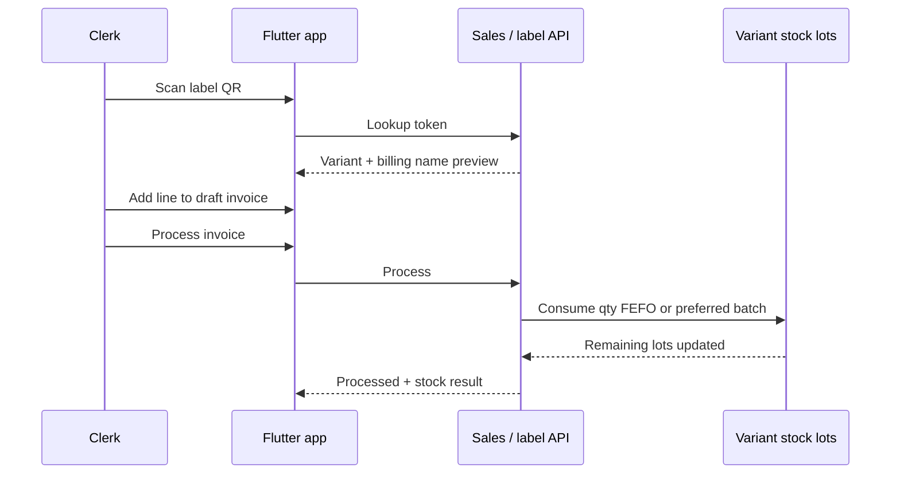

# Case study 2 — Scan → invoice → stock

**Domain:** Mobile sales ops + batch/lot inventory  
**Role:** Full-stack product (Flutter, APIs, FEFO consumption)  
**One-liner:** Clerks stopped writing invoices from memory at the desk — they scan the shelf, and processing draws down the right lots.

---

## Before → After (clerk day)

### Before — “Walk the shelf, then rebuild the bill at the desk”

Typical sales day:

1. Clerk walks the warehouse / counter with a mental list or paper note
2. Remembers (or misremembers) product names, sizes, packs
3. Sits at a desktop invoice screen and **retypes** every line
4. Batch / expiry is free text, guessed from purchase history, or skipped
5. Stock is updated later — or never tied to the exact lot that left the shelf
6. Disputes: “We billed X but picked Y” / “System says 12, shelf has 7”

**Pain:** double work, name drift, weak FEFO, stock that doesn’t match physical.

### After — “Scan on the floor → draft on phone → process commits stock”

1. Clerk scans the **printed stock label** on the unit
2. Phone shows the correct variant + billing name (server lookup from a short QR token)
3. One tap adds the line to a **draft sales invoice** (customer already chosen)
4. Repeat scans until the order is complete; edit qty on device
5. **Process** is the commit: system consumes lots FEFO (or clerk-chosen batch), updates remaining qty, records sold metrics

**Gain:** the shelf is the source of truth; the desk is for exceptions and payment — not re-entry.



---

## Concrete before / after on one sale (synthetic)

| Step | Before | After |
| --- | --- | --- |
| **Identify product** | Read box, remember Tally name | Scan `demo:abc123~4` → preview “Orthodontic Primer 10cc” |
| **Add to invoice** | Type name at PC; risk wrong pack | Tap **Add to draft** on phone |
| **Choose batch** | Free text or ignore expiry | Default soonest expiry; override if needed |
| **Finish job** | Save invoice; stock “maybe later” | Process → remaining lots drop in the stock panel |
| **Prove it** | Argue from memory | Lot shows `remaining / original`; sold metrics on variant |

---

## Problem (why this mattered)

If scan, billing name, and lot consumption disagree:

- Invoices don’t match what left the shelf
- Stock counts drift from physical
- Sold analytics can’t trust free-text descriptions

---

## Approach

### End-to-end loop



### Label + line mapping

Printed stickers use a **short opaque token**; product data lives server-side.

| Clerk-facing | System-facing |
| --- | --- |
| Billing / ledger line name | String accounting systems expect |
| Variant detail / notes | Human SKU context |
| Hidden IDs | Variant + family keys for stock |

### When inventory moves

Draft edits do **not** consume stock. **Process** does:

1. Each line → `variantStockId`
2. Preferred batch if clerk overrode; else FEFO by expiry
3. Decrement lot `remainingQuantity`; refresh summaries
4. Attach sold qty/amount to the variant for analytics

---

## Impact (illustrative / synthetic)

| Metric | Before | After (target shape) |
| --- | --- | --- |
| Path to invoice line | Memory + keyboard | Scan → confirm |
| Median time shelf → billed | Long (two-pass) | Single-pass on phone (~few minutes) |
| Batch / expiry discipline | Optional / guessed | Default FEFO on process |
| Stock after sale | Often stale | Lot remaining updates with the invoice |
| “Wrong item billed” disputes | Common | Traceable: label → variant → lot |

```text
Weekly ops narrative (demo numbers)
- Scans resolved: ~98%
- Processes with no stock exception: ~94%
- Median first-scan → process: ~3–4 min
- FEFO overrides: ~10% (promos / customer-requested batch)
```

---

## What I’d improve next

- Auth-hardened scan APIs beyond LAN/internal use
- Clear UX when qty must split across multiple lots
- Offline scan queue + conflict review when connectivity drops

---

## Screenshots (placeholders)

| Asset | Intent |
| --- | --- |
| `assets/02-before-desk-entry.png` | Blurred desktop retyping flow |
| `assets/02-after-scan-preview.png` | Phone scan preview (fake product) |
| `assets/02-draft-invoice.png` | Draft lines — redacted customer |
| `assets/02-lot-drawdown.png` | Lots panel: remaining / original after process |
