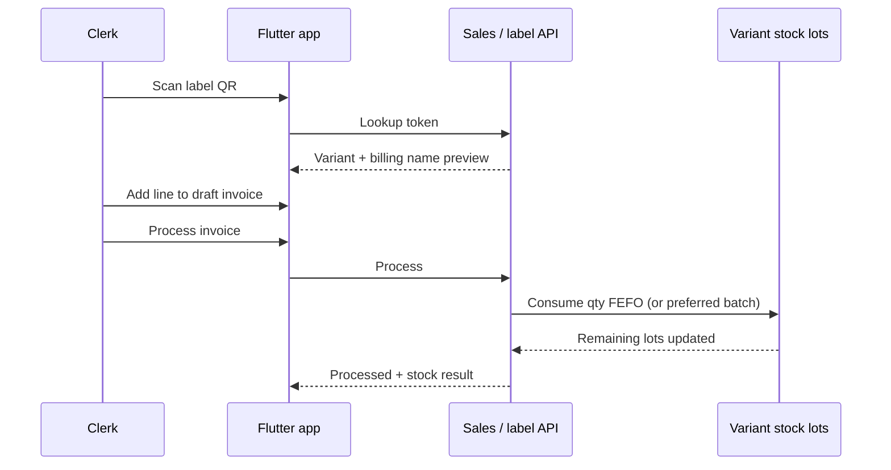
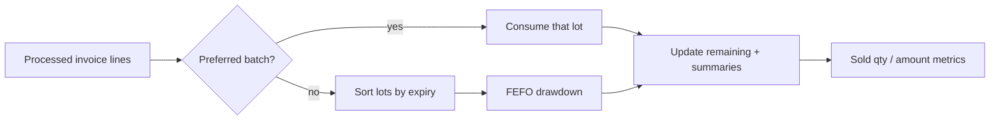

# Case study 2 — Scan → invoice → stock analytics

**Domain:** Mobile sales ops + inventory lots  
**Role:** Full-stack product (Flutter client, API, stock consumption design)  
**Status:** Production pattern (details sanitized)

---

## Problem

Wholesale sales often start at the shelf: a clerk scans a printed stock label, needs a correct invoice line, then must draw down the **right variant’s batches** (preferably FEFO) when the invoice is processed.

If scan, billing name, and lot consumption disagree, you get:

- invoices that don’t match what left the shelf
- stock counts that drift from physical
- no trustworthy sold metrics on variants

---

## Constraints

- Labels must stay short (QR token), not dump full product payloads
- Draft invoices need fast add/edit on phone; process is a deliberate commit
- Batch selection defaults to FEFO but allows clerk override
- Public materials use fake QR payloads and blurred UI only

---

## Approach

### End-to-end loop



### Label design

Printed stickers encode a **short opaque token** (print run + sequence). Full product resolution lives server-side. The phone sends the raw scan string; the API returns the catalog variant, Tally-facing description, and clerk-facing notes.

Illustrative (fake) token shape:

```text
demo:{printRunId}~{sequence}
```

### Invoice line mapping (concept)

| What the clerk sees | What the system stores |
| --- | --- |
| Billing / ledger line name | Canonical sell string for downstream accounting |
| Variant detail / notes | Human-readable SKU context |
| Hidden links | Variant + family IDs for stock |

### Stock consumption

On process (not on every draft edit):

1. Resolve each line to `variantStockId`
2. Prefer clerk-chosen batch when present; otherwise FEFO by expiry
3. Decrement `remainingQuantity` on lots; refresh denormalized stock summaries
4. Record sale metrics on the variant for analytics



---

## Analytics that mattered

| Metric | Question it answers |
| --- | --- |
| Scan → line success rate | Are labels and lookup healthy? |
| Process failures (over-sell, missing lots) | Where does physical stock disagree with system? |
| FEFO override rate | Are clerks fighting the default — and why? |
| Time from first scan to processed invoice | Is mobile actually faster than desk entry? |
| Variant sold qty vs lot drawdown | Did accounting and inventory stay in sync? |

Illustrative dashboard narrative (synthetic):

```text
Weekly ops (demo numbers)
- Scans resolved: 98.2%
- Invoices processed without stock exception: 94%
- Median scan→process: 3.4 min
- FEFO overrides: 11% (mostly near-expiry promotions)
```

---

## Outcome

- Shelf action becomes the source of truth for the draft line
- Processing is the hard boundary where inventory moves
- Stock UI can show remaining / original per lot — clerks can verify drawdown visually
- Analytics attach to catalog variants, not orphan free-text descriptions

---

## What I’d improve next

- Auth-hardened scan APIs for anything beyond LAN/internal use
- Split-across-lots UX when qty exceeds a single batch
- Lightweight offline queue for scans in poor connectivity, with conflict review on sync

---

## Screenshots (placeholders)

> Replace with blurred UI / synthetic data before sharing widely.

| Asset | Intent |
| --- | --- |
| `assets/02-scan-preview.png` | Phone scan preview with fake product |
| `assets/02-draft-invoice.png` | Draft invoice lines (redacted customer) |
| `assets/02-lot-drawdown.png` | Stock lot panel after process |

```text
assets/
  02-scan-preview.png    # TODO: blurred Flutter UI
  02-draft-invoice.png   # TODO: synthetic customer / amounts
  02-lot-drawdown.png    # TODO: remaining/quantity lots view
```
