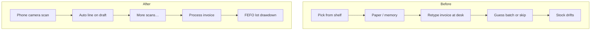
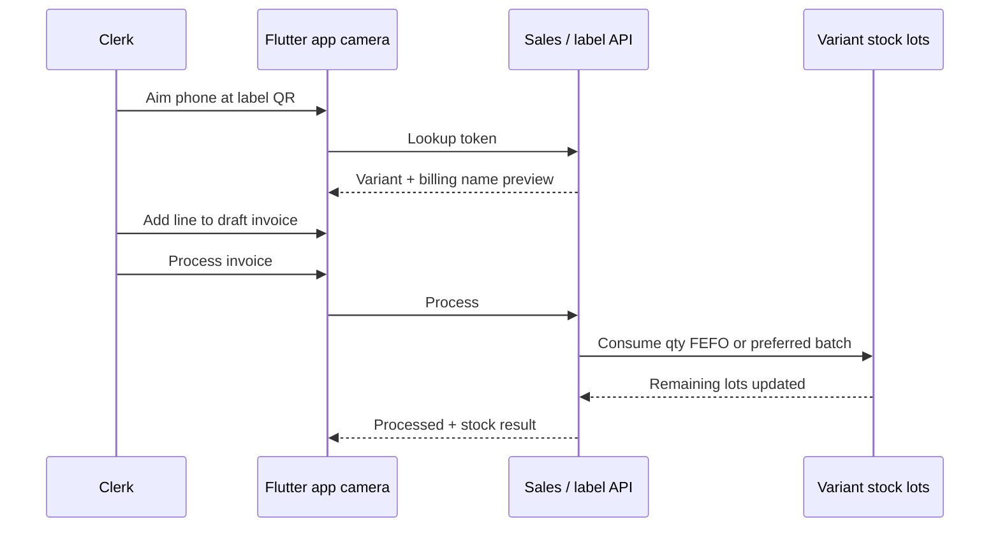

# Case study 2 — Scan → invoice → stock

**Domain:** Mobile sales ops + batch/lot inventory  
**Role:** Full-stack product (Flutter, APIs, FEFO consumption)  
**One-liner:** Clerks stopped writing invoices from memory at the desk — they scan the shelf with the **phone camera only**, and processing draws down the right lots.

---

## No external scanner required

Hardware barcode guns, sleds, and dedicated terminals are optional in this design — not required.

Clerks use a normal smartphone:

1. Open the sales app → **Scan**
2. Point the **built-in camera** at the printed stock-label QR
3. App detects the code, looks up the variant, and offers **Add to draft invoice**
4. Repeat on the floor; **Process** commits FEFO stock drawdown

```text
Shelf label (printed QR)  →  Phone camera  →  Draft line  →  Process → lots
         ↑                        ↑
   no gun / no sled        no extra device
```


*Illustrative: phone-only scan of a printed warehouse label.*

---

## Before → After (clerk day)


### Before — “Walk the shelf, then rebuild the bill at the desk”

Typical sales day:

1. Clerk walks the warehouse / counter with a mental list or paper note
2. Remembers (or misremembers) product names, sizes, packs
3. Sits at a desktop invoice screen and **retypes** every line
4. Batch / expiry is free text, guessed from purchase history, or skipped
5. Stock is updated later — or never tied to the exact lot that left the shelf
6. Disputes: “We billed X but picked Y” / “System says 12, shelf has 7”

**Pain:** double work, name drift, weak FEFO, stock that doesn’t match physical. Extra hardware wasn’t the bottleneck — **re-entry** was.

### After — “Scan on the floor → draft on phone → process commits stock”

1. Clerk scans the **printed stock label** with the phone camera
2. Phone shows the correct variant + billing name (server lookup from a short QR token)
3. One tap adds the line to a **draft sales invoice**
4. Repeat scans until the order is complete; edit qty on device
5. **Process** is the commit: system consumes lots FEFO (or clerk-chosen batch)

**Gain:** the shelf is the source of truth; the desk is for exceptions and payment — not re-entry. Adoption is easier because every clerk already has the “scanner.”

| | Before | After |
| --- | --- | --- |
| **Capture device** | Eyes + paper + keyboard | Phone camera |
| **External scanner** | Sometimes hoped for | Not required |
| **Where invoice is built** | Desk, after the walk | On the floor, as you scan |
| **Stock timing** | Later / maybe never | On process, same flow |



---

## What the clerk sees after a scan


*Mock UI with synthetic product names — not production screenshots.*

---

## Concrete before / after on one sale (synthetic)

| Step | Before | After |
| --- | --- | --- |
| **Identify product** | Read box, remember Tally name | Point phone at QR → preview “Orthodontic Primer 10cc” |
| **Add to invoice** | Type name at PC; risk wrong pack | Tap **Add to draft** on phone |
| **Choose batch** | Free text or ignore expiry | Default soonest expiry; override if needed |
| **Finish job** | Save invoice; stock “maybe later” | Process → remaining lots drop in the stock panel |
| **Prove it** | Argue from memory | Lot shows `remaining / original`; sold metrics on variant |

---

## Problem (why this mattered)

If scan, billing name, and lot consumption disagree:

- Invoices don’t match what left the shelf
- Stock counts drift from physical
- Sold analytics can’t trust free-text descriptions

Requiring a dedicated scanner would slow rollout. Phone-camera QR keeps the loop usable on day one.

---

## Approach

### End-to-end loop



### Label + line mapping

Printed stickers use a **short opaque token**; product data lives server-side. The phone only needs a camera — no special decode hardware.

| Clerk-facing | System-facing |
| --- | --- |
| Billing / ledger line name | String accounting systems expect |
| Variant detail / notes | Human SKU context |
| Hidden IDs | Variant + family keys for stock |

### When inventory moves

Draft edits do **not** consume stock. **Process** does:

1. Each line → `variantStockId`
2. Preferred batch if clerk overrode; else FEFO by expiry
3. Decrement lot `remainingQuantity`; refresh summaries
4. Attach sold qty/amount to the variant for analytics

---

## Impact (illustrative / synthetic)

| Metric | Before | After (target shape) |
| --- | --- | --- |
| Path to invoice line | Memory + keyboard | Phone camera → confirm |
| Extra hardware | Nice-to-have / missing | None required |
| Median time shelf → billed | Long (two-pass) | Single-pass on phone |
| Batch / expiry discipline | Optional / guessed | Default FEFO on process |
| Stock after sale | Often stale | Lot remaining updates with the invoice |

```text
Weekly ops narrative (demo numbers)
- Scans resolved: ~98%
- Processes with no stock exception: ~94%
- Median first-scan → process: ~3–4 min
- FEFO overrides: ~10% (promos / customer-requested batch)
```

---

## What I’d improve next

- Auth-hardened scan APIs beyond LAN/internal use
- Clear UX when qty must split across multiple lots
- Offline scan queue + conflict review when connectivity drops

---

## Image credits

Illustrations are **synthetic mockups** for the public portfolio (fake products, redacted customer). They demonstrate the phone-camera workflow — not production exports or real customer data.
